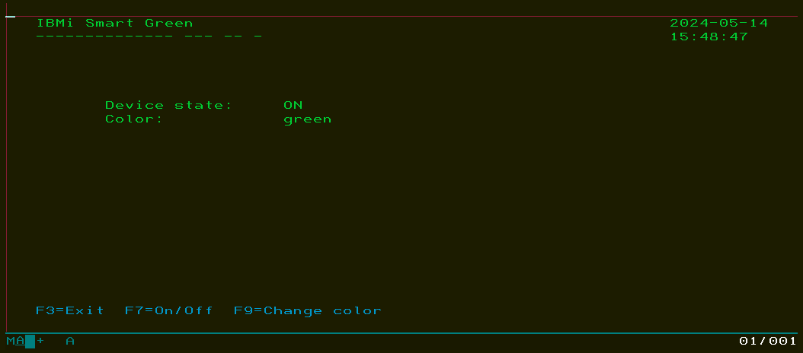

# IBMi Smart Green

The system monitors the state and color of a smart home device and allows for control on IBM i.

## Getting Started

To get started with the project, follow these steps:

1. Clone the repository to your local machine.

2. Run the following command to clean and build the project:
    ```
    /QOpenSys/pkgs/bin/gmake clean all
    ```

3. Insert initial data into the `SMARTDEV` table:
    ```
    INSERT INTO SMARTDEV (device_id, type, state, color) VALUES ('bf0e0d6a255a9bbf015x4i', 'LIGHT', 'OFF', 'GREEN');
    INSERT INTO SMARTDEV (device_id, type, state) VALUES ('bfe1c109b7f231a15955hq', 'SWITCH', 'OFF');
    ```
    
4. Retrieve the data from the `SMARTDEV` table:
    ```
    SELECT * FROM SMARTDEV;
    ```

## Running Smart Listener
```
SBMJOB   JOB(LISTENER)  CMD(CALL LISTENER PARM('SMARTLIB'))
```

## Running Smart Device Manager

Run the following command in session
```
CALL SMARTD
```

